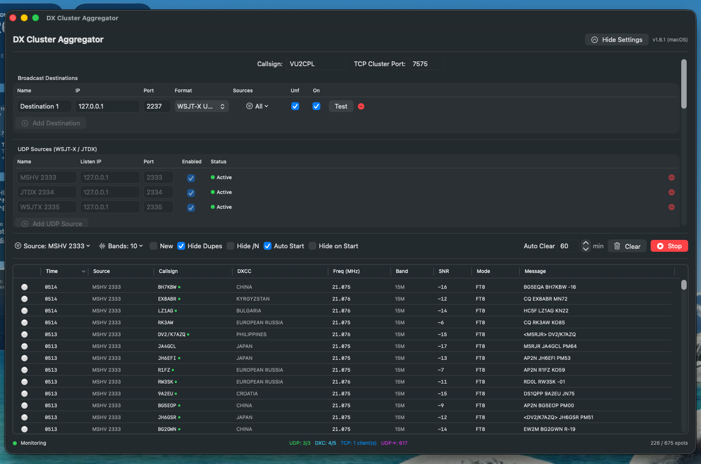
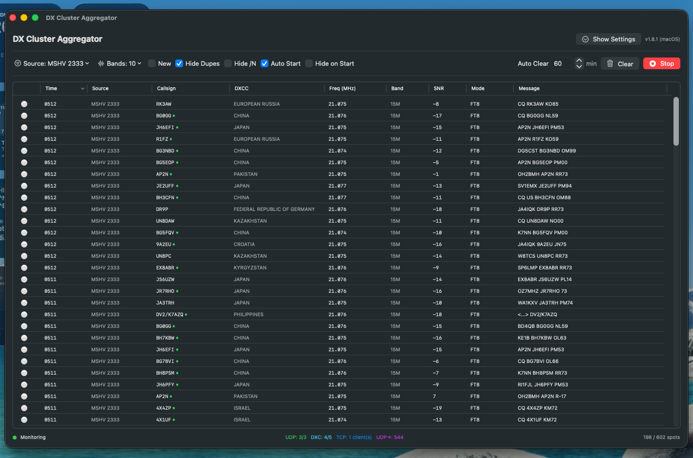
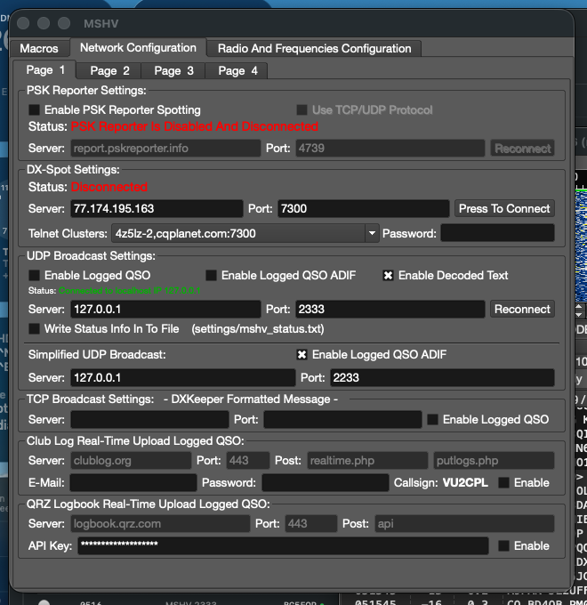
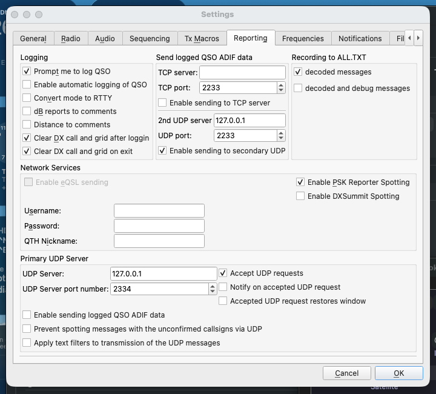
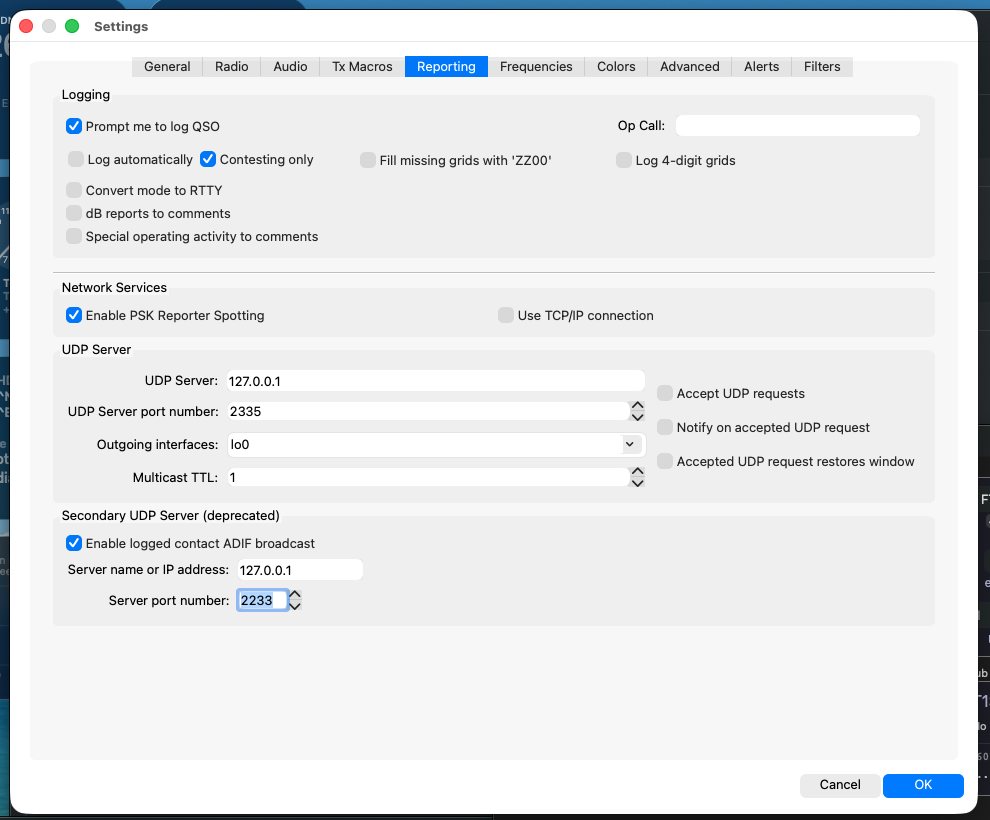
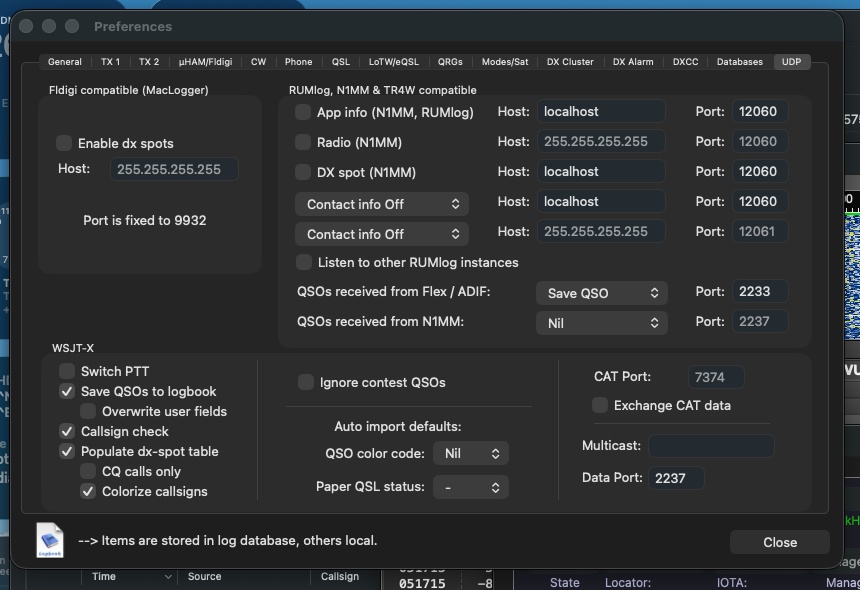

# The Shack UDP Pipeline — MSHV + JTDX + WSJT-X → DXCA → RUMlogNG

Wiring three FT8/FT4 decoders (MSHV, JTDX, WSJT-X) and a logger (RUMlogNG) so
they run **simultaneously**, share every decoded spot, and don't fight over UDP
ports at reboot.

This has been a recurring pain point (post-OS-update in particular): apps race
to bind port 2237 at login, one wins, everyone else silently fails, and it
looks like "the aggregator is hung". This doc is the canonical wiring — follow
it and the whole graph starts up in any order without clashes.

> **v1.8.2 update:** the RUMlog broadcast destination is now **Passthrough**
> instead of *WSJT-X UDP*. Passthrough forwards every incoming decoder
> datagram to RUMlog verbatim, which preserves the WSJT-X Status stream —
> including the click-to-fill Status updates that fire when the operator
> selects a callsign in a decoder's list. The old *WSJT-X UDP* format
> synthesised one Status+Decode pair per aggregated spot and stripped
> everything else, which silently broke RUMlog's callsign auto-fill / QRZ
> lookup for anyone routing decoders through DXCA. If you're on v1.8.1 or
> earlier, change the format to Passthrough after upgrading.

## The rule that makes this work

**DXClusterAggregator (DXCA) is the sole listener on every WSJT-X port.**
Every decoder targets a distinct DXCA input port. DXCA then forwards each
datagram verbatim (Passthrough) to the port RUMlog listens on. No two
processes ever try to bind the same port, and every WSJT-X message type
(Status, Decode, Heartbeat, Clear, QSO Logged, …) reaches RUMlog intact.

## Topology

Each decoder sends **two** streams: live decodes (WSJT-X binary → DXCA on its
own port) and completed-QSO ADIF (raw text → RUMlog directly on 2233,
regardless of which decoder logged it).

```
                  ┌─── UDP :2333 ───►  DXCA "MSHV" source (decodes)
   MSHV  ─────────┤
                  └─── UDP :2233 ───┐
                                    │
                  ┌─── UDP :2334 ───┼───►  DXCA "JTDX" source (decodes)
   JTDX  ─────────┤                 │
                  └─── UDP :2233 ───┤
                                    │
                  ┌─── UDP :2335 ───┼───►  DXCA "WSJTX" source (decodes)
   WSJT-X ────────┤                 │
                  └─── UDP :2233 ───┘

                       (three senders, one port)
                                    │
                                    ▼
                       RUMlogNG "QSOs received from Flex / ADIF"
                       (ADIF text — logged QSOs only)

                                       ┌─►  TCP :7575  (local cluster server)
                                       │     RUMlogNG "DX Cluster" tab
                                       │     Logger32, N1MM+, Log4OM, MiniM4 Pro, …
   DXCA aggregates all decoders ───────┤
                                       │
                                       └─►  UDP :2237  (Passthrough — raw
                                             WSJT-X datagrams forwarded from
                                             all sources verbatim, keeps
                                             click-to-fill working)
                                             RUMlogNG "Data Port" (WSJT-X section)
```

## Port allocation

| Port  | Direction               | Producer                 | Consumer               | Wire format          |
|-------|-------------------------|--------------------------|------------------------|----------------------|
| 2333  | UDP → 127.0.0.1         | MSHV (decodes)           | DXCA "MSHV" source     | WSJT-X binary        |
| 2334  | UDP → 127.0.0.1         | JTDX (decodes)           | DXCA "JTDX" source     | WSJT-X binary        |
| 2335  | UDP → 127.0.0.1         | WSJT-X (decodes)         | DXCA "WSJTX" source    | WSJT-X binary        |
| 2237  | UDP → 127.0.0.1         | DXCA passthrough         | RUMlogNG WSJT-X input  | WSJT-X binary (raw)  |
| 2233  | UDP → 127.0.0.1         | MSHV, JTDX, WSJT-X (QSO logs) | RUMlogNG Flex/ADIF | Raw ADIF text        |
| 7575  | TCP LISTEN              | DXCA                     | Any DX cluster client  | Cluster telnet lines |

No port appears in the "Consumer" column twice. That is the invariant. Port
2233 has three producers, but they are all sending (`sendto`) — none binds it
— so they never collide; RUMlog is the only listener and reads whichever ADIF
record arrives.

## Per-app configuration

### 1. DX Cluster Aggregator

Open **Show Settings** on the main window.



> Screenshot pre-dates v1.8.2 and shows Destination 1's Format as *WSJT-X U…* —
> on v1.8.2 or later, change it to **Passthrough** for the reason explained
> in the callout at the top of this doc.

- **TCP Cluster Port:** `7575` (do not use 7550 — SkimSrv defaults to it).
- **UDP Sources (WSJT-X / JTDX)** — three rows, `127.0.0.1` on all:
  - `MSHV 2333` — port `2333`
  - `JTDX 2334` — port `2334`
  - `WSJTX 2335` — port `2335`
  All three Enabled. Status should read **Active** once services are up.
- **Broadcast Destinations** — one row:
  - Name `Destination 1`, IP `127.0.0.1`, Port `2237`, Format
    **Passthrough**, Sources **All**, **On ✓**. *(The Unf flag doesn't
    apply to Passthrough — it forwards every raw datagram regardless.)*

That destination forwards every incoming datagram from every enabled UDP
source verbatim to 127.0.0.1:2237. RUMlog receives the decoders' native
WSJT-X Status/Decode/... stream unchanged, so the click-to-fill callsign
lookup works exactly as if the decoder were pointed at RUMlog directly.

> If you also want an aggregated / deduplicated spot stream to a *separate*
> tool (e.g. an RBN uploader), add a second broadcast destination on a
> different port using the **WSJT-X UDP** format — the two paths coexist
> because Passthrough entries skip the per-spot synthesis path (see the
> `continue` in `UDPBroadcaster.broadcast`) and vice-versa.



Live status bar reads e.g. `Monitoring · UDP: 3/3 · DXC: 4/5 · TCP: 1
client(s) · UDP→: 617` — three UDP sources proven live, four of five cluster
nodes proven live, one logger connected on 7575, 617 spots forwarded out via
UDP broadcast.

### 2. MSHV

Menu → **Options → Network Configuration** → *Network Configuration* tab.



- **UDP Broadcast Settings** (the WSJT-X-compatible binary feed):
  - Server `127.0.0.1`, Port `2333`
  - **Enable Decoded Text** ✓ (this is what DXCA needs)
  - **Enable Logged QSO** ✗
  - **Enable Logged QSO ADIF** ✗

  Status line should turn green: `Connected to localhost IP 127.0.0.1`.

- **Simplified UDP Broadcast** (raw ADIF text — separate, for RUMlog logging):
  - Server `127.0.0.1`, Port `2233`
  - **Enable Logged QSO ADIF** ✓

The two are not interchangeable — see [Why two MSHV feeds?](#why-two-mshv-feeds)
below.

### 3. JTDX

**JTDX menu → Preferences...** → **Reporting** tab.



Two independent outputs on this tab — set both:

- **Primary UDP Server** (bottom half, feeds DXCA):
  - UDP Server: `127.0.0.1`
  - UDP Server port number: `2334`
  - ✓ Accept UDP requests
  - Leave *Enable sending logged QSO ADIF data* **unchecked** here — the
    ADIF path is the *secondary UDP*, not this one.
- **Send logged QSO ADIF data** (top-right, feeds RUMlog directly):
  - 2nd UDP server: `127.0.0.1`
  - UDP port: `2233`
  - ✓ Enable sending to secondary UDP
  - Leave the TCP server row empty and *Enable sending to TCP server*
    unchecked — nothing on this shack listens on JTDX's ADIF-over-TCP.

The 2nd UDP path is JTDX's equivalent to MSHV's Simplified UDP Broadcast.
Both target the same RUMlog listener (`127.0.0.1:2233`).

### 4. WSJT-X

**WSJT-X menu → Preferences...** → **Reporting** tab.



Same two-output pattern as JTDX:

- **UDP Server** (feeds DXCA):
  - UDP Server: `127.0.0.1`
  - UDP Server port number: `2335`
  - Outgoing interfaces: `lo0` (loopback only — no packets on the LAN)
  - Multicast TTL: `1` (unused here; we're not multicasting)
- **Secondary UDP Server (deprecated)** (feeds RUMlog directly):
  - ✓ Enable logged contact ADIF broadcast
  - Server name or IP address: `127.0.0.1`
  - **Server port number: `2233`** ← this must match RUMlog's Flex/ADIF
    listener, not any DXCA input port. Sending to 2333 (DXCA's MSHV input)
    is a common misconfiguration — DXCA's `WSJTXMessageParser` will reject
    the ADIF text as malformed WSJT-X binary and drop it silently, and
    RUMlog will never see the logged QSO.

WSJT-X labels this section *deprecated*; it still works and is the only
built-in path for logged-contact ADIF-over-UDP that WSJT-X ships with, so it
stays in use until the project offers a replacement. When they do, the
replacement will still need to target `127.0.0.1:2233`.

### 5. RUMlogNG

**RUMlogNG → Preferences** (`⌘,`) → **UDP** tab.



- **WSJT-X** section (bottom-left):
  - ✓ Save QSOs to logbook
  - ✓ Callsign check
  - ✓ Populate dx-spot table
  - ✓ Colorize callsigns
- **Data Port** (bottom-right): `2237`  ← receives DXCA's rebroadcast.
- **Multicast:** leave *empty* (we are using unicast forwarding through DXCA;
  no multicast group is involved).
- **QSOs received from Flex / ADIF:** `Save QSO`, Port `2233`  ← receives
  MSHV's Simplified UDP Broadcast for QSO logging.
- **QSOs received from N1MM:** `Nil`, Port `2237` (the row is disabled by
  the Nil action — the port field being 2237 is cosmetic and does not open a
  second listener; the WSJT-X `Data Port` above is the one that binds).

Also configure **DX Cluster** in RUMlogNG's separate DX Cluster tab to point
at `127.0.0.1:7575` — that pulls cluster spots from DXCA's TCP cluster server.

## Why two MSHV feeds?

MSHV's *main* UDP Broadcast (port 2333 in this setup) is a **WSJT-X-compatible
binary** stream. Its three checkboxes select which WSJT-X message types are
emitted on that single socket:

| Checkbox                | WSJT-X message | Emitted when                     |
|-------------------------|----------------|----------------------------------|
| Enable Decoded Text     | type-2 Decode  | Every FT8/FT4 decode             |
| Enable Logged QSO       | type-5 QSO Log | You click *Log QSO* in MSHV      |
| Enable Logged QSO ADIF  | type-12 ADIF   | You click *Log QSO* in MSHV      |

DXCA's UDP listener only forwards WSJT-X **type-1 (Status)** and **type-2
(Decode)** — types 5 and 12 fall into `default: break` in
[`WSJTXUDPListener.processMessage`](../DXClusterAggregator/Network/WSJTXUDPListener.swift)
and are dropped on the floor. So enabling Logged-QSO on port 2333 would send
datagrams that no downstream consumer ever sees — dead weight.

MSHV's **Simplified UDP Broadcast** is a completely separate socket that
sends **raw ADIF text** (no WSJT-X framing) on a different port. RUMlogNG has
a dedicated listener for exactly this on its "QSOs received from Flex / ADIF"
port. That is the working MSHV → RUMlog QSO-logging path.

**Bottom line:** the "Simplified" feed is redundant for *spots* (which is
what we discussed while wiring DXCA), but it's the **only** path for MSHV's
*logged QSOs* to reach RUMlog. Keep it enabled.

JTDX and WSJT-X have the same pattern — a *primary* UDP for live
decodes/status (WSJT-X binary → DXCA) and a *secondary* UDP for logged-QSO
ADIF text → RUMlog. In JTDX that's *"Send logged QSO ADIF data → 2nd UDP
server"*; in WSJT-X it's *"Secondary UDP Server (deprecated) → Enable logged
contact ADIF broadcast"*. Both must target `127.0.0.1:2233`, matching MSHV's
Simplified UDP Broadcast and RUMlog's Flex/ADIF listener. See §3 and §4 for
screenshots.

That means all three decoders reach RUMlog's log the same way (raw ADIF on
2233), and RUMlog's WSJT-X binary listener on 2237 stays reserved for DXCA's
rebroadcast of *live spots* — no QSO-log traffic goes through DXCA at all,
so DXCA's `default: break` on WSJT-X type-5 / type-12 is fine.

## Reboot survival

Every port is bound by exactly one process:

- 2333/2334/2335 — only DXCA listens (each decoder is a *sender*, not a listener).
- 2237 — only RUMlogNG listens (DXCA is a sender to it).
- 2233 — only RUMlogNG listens (MSHV is a sender to it).
- 7575 — only DXCA listens.

If any two of these apps race at boot, none of their `bind()` calls can
collide because they are targeting disjoint ports. The pathological old
setup (MSHV, DXCA and RUMlog all listening on 2237) is impossible in this
arrangement.

## Troubleshooting

### "The aggregator is hung after a reboot"

Usually not the aggregator — usually a bind race. Check who owns each port:

```bash
lsof -iTCP:7575 -sTCP:LISTEN
lsof -iUDP:2237
lsof -iUDP:2333
lsof -iUDP:2334
lsof -iUDP:2335
```

If DXCA is running but a `lsof -iUDP:...` for one of the 2333/2334/2335 ports
shows a different process holding it, that's the bind race. The fix is a
one-time port juggle (that other process should move off), then the
canonical DXCA layout survives every subsequent reboot.

**Caveat:** DXCA's WSJT-X listener uses Apple's Network.framework
(`NWListener`), which the modern macOS Skywalk stack keeps invisible to
`lsof` on some releases. If `lsof -iUDP:2333` shows no owner but MSHV's
status line says `Connected to localhost` and DXCA's source row shows
`Active` with a rising spot count, the listener is fine — `lsof` just can't
see it. Trust the app UIs over `lsof` in that case.

### "MSHV row in DXCA shows Active but 0 spots"

Verify **Enable Decoded Text ✓** in MSHV's *main* UDP Broadcast (port 2333),
not the Simplified one. Only the main feed carries decodes; Simplified is
logged-QSO ADIF only.

### "RUMlog's WSJT-X ingest is empty"

- Is DXCA running and does its status bar show `UDP→: <nonzero>`? If not,
  DXCA isn't rebroadcasting.
- Is RUMlog's WSJT-X **Data Port** set to `2237`?
- Test the forwarding path from a terminal:
  ```bash
  nc -zv 127.0.0.1 7575     # DXCA cluster server (TCP)
  ```
- If DXCA's `TCP: N client(s)` is nonzero when RUMlog is running with its DX
  Cluster tab connected, the cluster path is working; a still-empty WSJT-X
  ingest means the UDP broadcast row in DXCA settings needs a re-check
  (**On ✓, Unf ✓, All sources**).

### "Both cluster spots and WSJT-X spots appear in RUMlog's DX Spots and I see duplicates"

Expected: RUMlog receives the same spot twice, once via its cluster tab
(from DXCA's TCP :7575) and once via the WSJT-X UDP path (DXCA's Passthrough
on :2237). If duplication is annoying, disable **Populate dx-spot table**
under WSJT-X in RUMlog to let the cluster path be the sole feed, or leave
WSJT-X on and disconnect RUMlog's DX Cluster tab from DXCA. Either is fine;
pick one and stick to it.

### "Clicking a callsign in WSJT-X/JTDX/MSHV doesn't auto-fill RUMlog's callsign field any more"

You're on DXCA v1.8.1 or earlier — the broadcast destination format is
*WSJT-X UDP*, which synthesises Status+Decode pairs per spot and drops
the original Status stream (including the click-to-fill updates). Upgrade
to v1.8.2 and change the destination Format to **Passthrough**.

## Version notes

- **DXCA v1.8.2** added the **Passthrough** broadcast format. Before v1.8.2
  the only WSJT-X-format option was the aggregated per-spot synthesis path,
  which stripped user-selection Status updates and broke RUMlog's
  click-to-fill callsign lookup. If you're on v1.8.1 or earlier and using
  the "decoders → DXCA → RUMlog" topology, upgrade and change your RUMlog
  broadcast destination's Format to **Passthrough**.
- DXCA v1.8.1 made the source status a clickable pill.
- DXCA v1.8.0 introduced honest cluster-status reporting (three-state badge,
  proven-live counters in the status bar), which is what lets you tell at a
  glance whether the UDP path is actually delivering.
- The v1.7.5 launch migration bumped any stored TCP cluster port from
  `7550 → 7575` (Skimmer clash). Existing installs from before v1.7.5 pick
  up 7575 automatically on first launch.

## See also

- [`../HANDOVER.md`](../HANDOVER.md) — cold-start dev doc.
- [`../README.md`](../README.md) — end-user overview and build instructions.
- [`../DXClusterAggregator_UserManual.pdf`](../DXClusterAggregator_UserManual.pdf) — printable manual.
